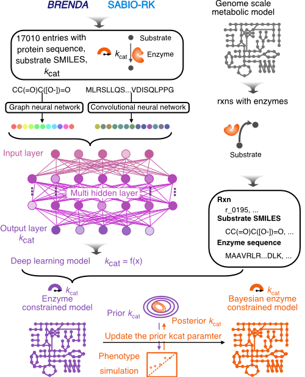

DLKcat
======

  

Introduction
------------

The **DLkcat** toolbox is a Matlab/Python package for prediction of
kcats and generation of the ecGEMs. The repo is divided into two parts:
`DeeplearningApproach` and `BayesianApproach`. `DeeplearningApproach`
supplies a deep-learning based prediction tool for kcat prediction,
while `BayesianApproach` supplies an automatic Bayesian based pipeline
to construct ecModels using the predicted kcats.

Usage
-----

-   Please check the instruction `README` file under these two section
    `Bayesianapproach` and `DeeplearningApproach` for reporducing all figures in
    the paper.
-   For people who are interested in using the trained deep-learning
    model for their own kcat prediction, we supplied an example. please
    check usage for **detailed information** in the file
    [DeeplearningApproach/README](https://github.com/SysBioChalmers/DLKcat/tree/master/DeeplearningApproach)
    under the `DeeplearningApproach`.

    > -   `input` for the prediction is the `Protein sequence` and
    >     `Substrate SMILES structure/Substrate name`, please check the
    >     file in
    >     [DeeplearningApproach/Code/example/input.tsv](https://github.com/SysBioChalmers/DLKcat/tree/master/DeeplearningApproach/Code/example)
    > -   `output` is the correponding `kcat` value

Citation
-----

- Currently, please cite the preprint paper [Deep learning based kcat prediction enables improved enzyme constrained model reconstruction](https://www.biorxiv.org/content/10.1101/2021.08.06.455417v1)""

Contact
-------

-   Feiran Li ([@feiranl](https://github.com/feiranl)), Chalmers
    University of Technology, Gothenburg, Sweden
-   Le Yuan ([@le-yuan](https://github.com/le-yuan)), Chalmers
    University of Technology, Gothenburg, Sweden

Last update: 2022-04-09
